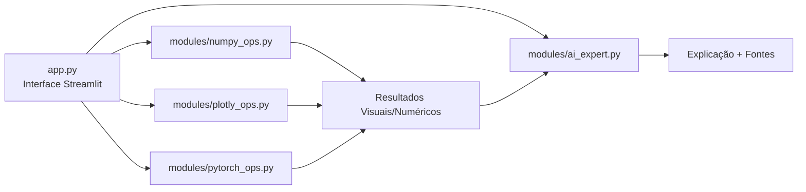

# 🧠 Hermes Math Studio – Estatística e Visualização com IA Local

[](https://python.org)
[](https://streamlit.io)
[](https://numpy.org)
[](https://plotly.com)
[](https://pytorch.org)
[](https://lmstudio.ai)
[](https://opensource.org/licenses/MIT)

Aplicação **Streamlit** que oferece um ambiente integrado para análise de dados educacional e profissional. O usuário pode aplicar, visualizar e **entender** conceitos matemáticos e estatísticos através de módulos interativos, com o suporte de uma **IA especialista local** (Hermes 3 via LM Studio) que explica os resultados, fornece contextos teóricos e fontes confiáveis.

---

## ✨ Funcionalidades

- 🔢 **Módulo NumPy:** Estatística descritiva, regressão linear por mínimos quadrados, Transformada Rápida de Fourier (FFT), matriz de correlação e projeção PCA.
- 📈 **Módulo Plotly:** Visualizações interativas como gráficos de dispersão (dataset Iris), séries temporais (ações), superfícies 3D e mapas coropléticos.
- 🧠 **Módulo PyTorch:** Implementação e treinamento de uma rede neural simples para classificação de dígitos (MNIST) com visualização da acurácia e exemplos de predições.
- 🤖 **Módulo IA Hermes:** Interpretação avançada de resultados. O usuário pode perguntar sobre qualquer saída gerada nos outros módulos, e a IA local (Hermes 3 3B) responde com explicações detalhadas, citando conceitos, fórmulas e até sugerindo fontes confiáveis.
- **Ambiente Integrado:** Todos os módulos reunidos em uma única interface, com inputs interativos (sliders, upload de dados) e outputs visuais instantâneos.
- **100% Local:** Todo o processamento, incluindo a IA, roda na sua máquina com **LM Studio**, garantindo privacidade total dos dados.

---

## 🏗️ Arquitetura do Sistema

A aplicação é dividida em módulos independentes que se comunicam via interface principal:



# 🚀 Como Executar o Projeto
## Pré-requisitos
```
Python 3.10+ instalado.

LM Studio com o modelo hermes-3-llama-3.2-3b carregado e o servidor local ativo na porta Local.

```
## Passo a Passo

1. **Clone o repositório**
   
   ```
   git clone https://github.com/Gussnogue/hermes-math-studio-estatistica-e-visualizacao-ai-numpy-plotly-pytorch.git
   cd hermes-math-studio-estatistica-e-visualizacao-ai-numpy-plotly-pytorch
   ```

2. **Crie e ative um ambiente virtual**

   ```
   python -m venv venv
   Windows
   venv\Scripts\activate
   Linux/macOS
   source venv/bin/activate
   ```

3. **Instale as dependências**

   ```
   pip install -r requirements.txt
   ```

4. **Execute a aplicação Streamlit**

   ```
   streamlit run app.py
   ```
# 🧠 Como Usar

- Na barra lateral, você encontrará os quatro módulos disponíveis: NumPy, Plotly, PyTorch e IA Especialista.

- Selecione um módulo (ex: NumPy). O sistema apresentará as operações disponíveis e os parâmetros que você pode ajustar (sliders, upload de arquivo, etc.).

- Execute a operação desejada. Os resultados numéricos e visuais (gráficos, tabelas) serão exibidos na área principal.

- Para obter uma explicação inteligente, vá até o módulo IA Especialista. Você encontrará um campo de texto pré‑preenchido com o resultado da última operação (ou pode colar qualquer texto). Clique em "Perguntar à IA Especialista" para receber uma análise detalhada do resultado, incluindo conceitos matemáticos envolvidos e sugestões de fontes confiáveis.

# 🛠️ Tecnologias Utilizadas

- Python 3.10+ – Linguagem base.

- Streamlit – Framework para criação da interface web interativa.

- NumPy – Computação numérica e operações de álgebra linear.

- Plotly – Visualização de dados interativa e de alta qualidade.

- PyTorch – Construção e treinamento de redes neurais (com suporte a GPU).

- LM Studio – Servidor local para execução de modelos de linguagem (Hermes 3 3B).

- Requests – Comunicação com a API do LM Studio.

- Scikit-learn – Geração de datasets sintéticos e métricas auxiliares.

# 📄 Licença

Este projeto está licenciado sob a MIT License. Sinta‑se à vontade para usar, modificar e distribuir.
